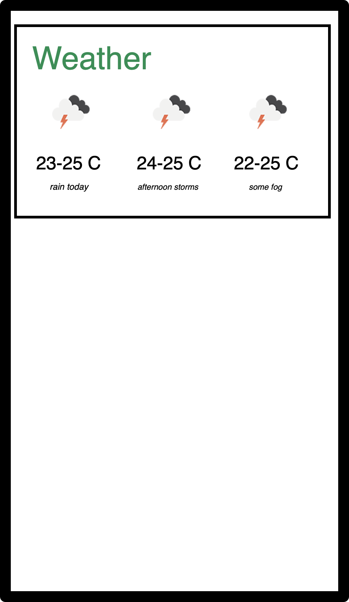

Apollo Agriculture Android Take Home Assignment
==============

Requirements
----
- Add a second screen to the app with weather data for the current location. Use the following initial wireframe we've made:
  
  
- The output from our weather API looks like this:
 ```json
{
  "today": {
  "lowTemp": 23.36,
  "highTemp": 24.66,
  "icon": "CLEAR_DAY",
  "description": "clear sky"
  },
  "tomorrow": {
  "lowTemp": 23.63,
  "highTemp": 24.9,
  "icon": "SCATTERED_CLOUDS_DAY",
  "description": "scattered clouds"
  },
  "dayAfterTomorrow": {
  "lowTemp": 22.73,
  "highTemp": 25.14,
  "icon": "BROKEN_OVERCAST_CLOUDS_DAY",
  "description": "broken clouds"
  }
}
 ```
Feel free to use however you think best in the app, it's also available at `https://apollo-web-public.s3.eu-west-1.amazonaws.com/eng/android-takehomeassignment/weather.json` so feel free to add an API client.
- Documentation for the API is available in `API.md` in this folder.
- Use any libraries for Android that you want, but we will need to be able to build your code to evaluate it.